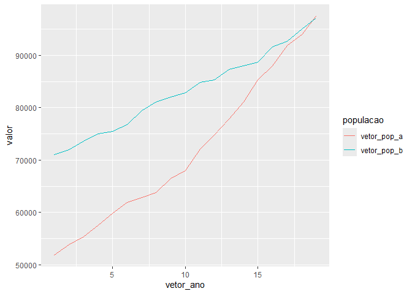

<!-- README.md is generated from README.Rmd. Please edit that file -->

# Iniciação Científica

## Material de auxílio no aprendizado

- Curso de Lógica de Programação (Juliana Braga, Edson Pimentel)
  <https://moocs.ggte.unicamp.br/course/logicadeprogramacao/intro>

## 1) Lógica de Programação

### Tipos de variáveis

#### Variáveis e Tipos Primários de Dados

Variável é, no sentido de programação, uma região de memória de um
computador, previamente identificada, que tem por finalidade armazenar
as informações (dados) de um programa temporariamente. Uma variável
armazena apenas um valor por vez, sendo considerado valor qualquer
conteúdo armazenado em uma variável. Um valor está relacionado ao tipo
de dado de uma variável, podendo ser numérico (inteiro ou real), lógico
ou caractere, ou seja, a forma pela qual o computador manipula essas
informações.

##### Identificadores (nome das variáveis)

Um identificador (nomes das variáveis, ou constantes) válido é uma
sequência de uma ou mais letras, dígitos ou underline (`_`). Nomes das
variáveis podem ser descritivos, e passam o significado daquele obejto,
sem ambiguidade.  
Nomes de variável podem ser atribuídos com um ou mais caracteres.  
Caracteres como espaços em branco, pontuações e símbolos especiais não
podem ser utilizados para formar os identificadores.  
Identificadores de variáveis devem sempre ser inicializados por letras,
ou mesmo por um underline (\_). Os identificadores não devem ser
iniciados por dígitos (números). Outra regra que devemos considerar é
que os identificadores não podem coincidir com palavras-chaves da
linguagem R, ou palavras específicas do compilador, as quais são
reservadas para o seu uso. As palavras-chaves reservadas são:

`if` - usado para realizar uma condição lógica;  
`else` - parte do bloco condicional para o caso contrário de uma
condição;  
`elseif`ou `else if` - utilizado para testar múltiplas condições
alternativas;  
`for` - usado para loops finitos;  
`while` - usado para loops baseados em uma condição lógica;  
`repeat` - usado para loops infinitos;  
`break` - usado para interromper um loop;  
`next` - usado para pular para a próxima iteração de um loop;  
`function` - usado para definir funções  
`return` - usado para retornar um valor de uma função  
`T` - valor lógico verdadeiro `TRUE`;  
`F` - valor falso `FALSE`.

Outro aspecto bastante importante é que a linguagem R é sensível ao case
(case sensitive). Isso significa que um identificador escrito em letra
maiúscula não é equivalente a outro identificador com o mesmo nome, mas
escrito em letras minúsculas. Por exemplo, a variável `RESULTADO`, não é
o mesmo que a variável `resultado`, ou `Resultado.` Eles são três
diferentes identificadores de variáveis.

Existem várias formas de escrever variáveis em programação, e cada
linguagem pode ter suas próprias convenções. Algumas das principais
formas:

`snake_case`: Neste estilo, as palavras são separadas por sublinhados
(underlines ou underscore) `(_)` e geralmente são escritas em letras
minúsculas. Por exemplo: `nome_completo`, `saldo_conta`,
`idade_usuario`. **É a forma mais descritiva e intuitiva para iniciar o
processo de aprendizado em programação, por isso a recomendada para esse
material**.

`camelCase`: Neste estilo, a primeira letra de cada palavra é escrita em
maiúscula, exceto a primeira palavra. Por exemplo: `nomeCompleto`,
`saldoConta`, `idadeUsuario.`

`PascalCase`: Similar ao `camelCase`, mas a primeira letra de cada
palavra é escrita em maiúscula, incluindo a primeira palavra. Por
exemplo: `NomeCompleto`, `SaldoConta`, `IdadeUsuario.`

`UPPERCASE`: Todas as letras da variável são escritas em maiúsculas,
geralmente usada para **constantes**. Por exemplo: `PI`, `TAXADEJUROS`.

`kebab-case`: As palavras são separadas por hífens (-), geralmente em
letras minúsculas. Menos comum em variáveis, mais usado em
identificadores de elementos HTML e URLs. Por exemplo: nome-completo,
saldo-conta, idade-usuario. Não é possível construir um identificador
kebab-case em R

`SNAKE_UPPERCASE`: Similar ao `snake_case`, mas todas as letras são
maiúsculas. Por exemplo: `NOME_COMPLETO`, `SALDO_CONTA`,
`IDADE_USUARIO`.

Em R, existem diferentes tipos de variáveis que podem ser utilizadas
para armazenar diferentes tipos de dados. Os principais tipos de
variáveis em R são::

`Numeric` do tipo `Double`: Variáveis numéricas são usadas para
armazenar números reais. Por exemplo:

``` r
altura <- 1.75
preco <- 25.99

# verificação
is.numeric(altura)
#> [1] TRUE
typeof(preco)
#> [1] "double"
```

`Numeric` do tipo `Integer`: Variáveis inteiras são usadas para
armazenar números inteiros. Os índices sempre serão números inteiros.
Por exemplo:

``` r
i <- 1L #O 'L' indica que é um número inteiro
ano <- 2024L

#verificação
is.numeric(i)
#> [1] TRUE
typeof(ano)
#> [1] "integer"
```

`Character`: Variáveis do tipo character são usadas para armazenar
texto. O texto deve ser colocado entre aspas simples (`' '`) ou duplas
(`" "`). Por exemplo:

``` r
nome <- "João"
sobrenome <- 'Silva'

#verificação
is.character(nome)
#> [1] TRUE
typeof(sobrenome)
#> [1] "character"
```

`Logical`: Variáveis lógicas armazenam valores booleanos (TRUE ou FALSE)
que representam condições lógicas. Por exemplo:

``` r
possui_carro <- TRUE
tem_filhos <- FALSE

#verificação
is.logical(possui_carro)
#> [1] TRUE
typeof(tem_filhos)
#> [1] "logical"
```

`Factor`: Variáveis fator são usadas para representar variáveis
categóricas. Utilizamos a função `factor`, do pacote `{base}` ou
`as_factor` do pacote `forcats`. Por exemplo:

``` r
nivel_educacional <- factor(c("Fundamental", "Médio", "Superior"))
cores_fator <- forcats::as_factor(c("vermelho", "azul", "verde", "amarelo"))

#verificação
is.factor(nivel_educacional)
#> [1] TRUE
typeof(cores_fator)
#> [1] "integer"
```

#### Expressões Aritméticas

Expressões aritméticas são aquelas cujos operadores são aritméticos e
cujos operandos são constantes, ou variáveis do tipo numérico (inteiro
ou real). Chamamos de operadores aritméticos o conjunto de símbolos que
representa as operações básicas da matemática, em R os principais
operadores são:

| Operator |    Função     |    Exemplos    |
|:---------|:-------------:|:--------------:|
| \+       |    Adição     |  2 + 3, X + Y  |
| \-       |   Subtração   |  4 – 2, N – M  |
| \*       | Multiplicação | 3 \* 4, A \* B |
| /        |    Divisão    |  10/2, X1/X2   |

Demais operações estão disponíveis em R, por exemplo, as operações de
radiciação e potenciação, observe a tabela:

| Operator    |       Função       |  Exemplos   |
|:------------|:------------------:|:-----------:|
| potenciação |   x elevado a y    | 3^2, x\*\*y |
| radiciação  | Raiz quadrada de x |   sqrt(9)   |

Tais função também podem ser utilizadas:

`sin()`: Retorna o valor do seno. Recebe como parâmetro o valor em
radianos em double.  
`cos()`: Retorna o valor do cosseno. Recebe como parâmetro o valor em
radianos em double.  
`tan()`: Retorna o valor da tangente. Recebe como parâmetro o valor em
radianos em double.  
`log()`: Retorna o valor do logaritmo na base neperiana. Exige um
parâmetro do tipo double.  
`log10()`: Retorna o valor do logaritmo na base 10. Exige um parâmetro
do tipo double.  
`exp()`: Retorna o valor da constante $e$ elevado ao parâmetro do tipo
double. O valor da constante $e$ é aproximadamente $2,71828$.

Usaremos outras operações matemáticas não-convencionais, porém, muito
úteis na construção de programas, que são o resto e o quociente de
divisão inteira:

| Operator |        Função        |      Exemplos       |
|:---------|:--------------------:|:-------------------:|
| %%       |   Resto da divisão   | 9 %% 4 resulta em 1 |
| %/%      | Quociente da divisão | 9%/%4 resulta em 2  |

Na resolução das expressões aritméticas, as operações guardam uma
hierarquia entre si:

| Prioridade |                    Operadores                     |
|:-----------|:-------------------------------------------------:|
| 1ª         |             Parênteses mais internos              |
| 2ª         | Potenciação, radiciação e funções trigonométricas |
| 3ª         |                   \*, /, %/% %%                   |
| 4ª         |                       +, -                        |

Em caso de empate (operadores de mesma prioridade), a resolução ocorre
da esquerda para a direita, conforme a sequência existente na expressão
trigonométrica. Para alterar a prioridade, utilizamos os parênteses mais
internos.

### Expressões Relacionais

Denominamos expressão relacionais aquela cujos operadores são lógicos ou
relacionais e cujos operandos são relações ou variáveis do tipo lógico.
Utilizamos os operadores relacionais para realizar comparações entre
dois valores de mesmo tipo primitivo. Tais valores são representados por
constantes, variáveis, ou expressões aritméticas. Os operadores
relacionais são comuns para construirmos os testes lógicos. Em R são
eles:

| Operator Relacional |           Função           |                     Exemplos                      |
|:--------------------|:--------------------------:|:-------------------------------------------------:|
| `>`                 |         Maior que          |               5 \> 4 retorna `TRUE`               |
| `>=`                |      Maior ou igual a      |             5 \>= 15 retorna `FALSE`              |
| `<`                 |         Menor que          |               3 \< 6 retorna `TRUE`               |
| `<=`                |      Menor ou igual a      |              3 \<= 5 retorna `TRUE`               |
| `==`                |          Igual a           | 3 == 3 retorna `TRUE`, ‘a’ == ‘A’ retorna `FALSE` |
| `!=`                | Não igual a (diferente de) |              8 != 9, retorna `TRUE`               |

O resultado obtido de uma relação sempre é um valor lógico. Por exemplo,
analisando a relação numérica A + B == C, o resultado será verdadeiro
(1) ou falso (0) à medida que o valor da expressão aritmética A + B seja
igual ou diferente do conteúdo da vaiável C, respectivamente.

### Expressões Lógicas

Utilizamos três operadores lógicos básicos para a formação de novas
proposições lógicas compostas a partir de outras proposições lógicas
simples. Os operadores lógicos em R são apresentados na tabela abaixo.

| Operator Lógico |     Função     |             Exemplos              |
|:----------------|:--------------:|:---------------------------------:|
| `!`             | Não (negação)  |     !(3 \> 5) retorna `TRUE`      |
| `&`             | E (conjunção)  |  3 \> 5 & 4 \< 8 retorna `FALSE`  |
| $\|$            | Ou (disjunção) | 3 \> 5 $\|$ 4 \< 8 retorna `TRUE` |

Tabela-verdade é o conjunto de todas as possibilidades combinatórias
entre os valores de diversas variáveis lógicas, as quais se encontram em
apenas duas situações Verdadeiro (`TRUE` equivale a $1$ ) ou Falso
(`FALSE` equivale a $0$ ), e um conjunto de operadores lógicos. Observe
o programa abaixo:

Tabela verdade para a operação de negação (Não), dado uma variável
lógicas A:

| A     | Não A |
|:------|:-----:|
| TRUE  | FALSE |
| FALSE | TRUE  |

Tabela verdade para a operação de conjunção (E), dado duas variáveis
lógicas A e B:

| A     |   B   | A E B |
|:------|:-----:|:-----:|
| TRUE  | TRUE  | TRUE  |
| TRUE  | FALSE | FALSE |
| FALSE | TRUE  | FALSE |
| FALSE | FALSE | FALSE |

Operação de disjunção ou não-exclusão (OU), dado duas variáveis lógicas
A e B:

| A     |   B   | A OU B |
|:------|:-----:|:------:|
| TRUE  | TRUE  |  TRUE  |
| TRUE  | FALSE |  TRUE  |
| FALSE | TRUE  |  TRUE  |
| FALSE | FALSE | FALSE  |

## Prática de Exercícios

### Comandos básicos

#### Atribuição, use `<-`.

``` r
x <- 4
```

Atribuição por teclado, use a função `readLine`. Você precisa digitar o
valor no console.

``` r
x <- readline("Digite número: ")
#> Digite número:
x
#> [1] ""
```

#### Imprimindo um valor na tela

``` r
x <- "Oi mundo"
print(x)
#> [1] "Oi mundo"
x
#> [1] "Oi mundo"
```

#### Estrutura de decisão:

Estrutura se: executada somente se a condição for verdadeira.

Imprima x se x for maior que zero.

``` r
x <- 3
if(x > 0){
  print(x)
}
#> [1] 3
```

Imprima x se x for maior que zero, caso contrário imprima “valor menor
que zero”.

``` r
x <- -5
if(x > 0){
  print(x)
}else{
  print("valor menor que zero")
}
#> [1] "valor menor que zero"
```

Estrutura do if utilizada em vetores.

``` r
notas <- c(9,3,4,2,6,5)
```

Se a nota for maior ou igual que 5, `aprovado`, caso contrário,
`reprovado`.

``` r
ifelse(notas >=5, "aprovado","reprovado")
#> [1] "aprovado"  "reprovado" "reprovado" "reprovado" "aprovado"  "aprovado"
```

Usando o `case_when()`, pacote `{tidyverse}`.

Classificar o dia de semana, 1 a 7, de domingo a sábado.

``` r
# Carregando o pacote
library(tidyverse)

# gerando numeros aleatorios de 1 a 7
num <- trunc(runif(20,1,8))
```

#### Estrutura de Repetição:

Imprimir número de 1 a 10

``` r
for(i in 1:10){
  print(i)
}
#> [1] 1
#> [1] 2
#> [1] 3
#> [1] 4
#> [1] 5
#> [1] 6
#> [1] 7
#> [1] 8
#> [1] 9
#> [1] 10
```

Diferente de “criar um vetor contendo os números de 1 a 10”;

``` r
meu_vetor <- 1:10
meu_vetor 
#>  [1]  1  2  3  4  5  6  7  8  9 10
```

Repetição condicional usando o `while`. Enquanto a condição for
verdadeira, a repetição continua (loop).

``` r
x <- 1
while (x <=10) {
  print(x)
  x <- x + 1 #o x é alterado em cada iteração
}
#> [1] 1
#> [1] 2
#> [1] 3
#> [1] 4
#> [1] 5
#> [1] 6
#> [1] 7
#> [1] 8
#> [1] 9
#> [1] 10
```

# Exercícios

### 1.1) Estrutura sequencial

1.  Crie um código que dado dois pontos quaisquer $P$ e $Q$ com
    coordenadas $P(x1 , y1)$ e $Q(x2 , y2)$,encontre a distância entre
    eles. Lembre-se que a distância $D$ é calculada como:

$D= \sqrt{(x_2-x_1)^2+(y_2-y_1)^2 )}$

``` r
# Entrada
x1 <- as.numeric(readline("Digite número coordenada (x) ponto P: "))
y1 <- as.numeric(readline("Digite número coordenada (y) ponto P: "))
x2 <- as.numeric(readline("Digite número coordenada (x) ponto Q: "))
y2 <- as.numeric(readline("Digite número coordenada (y) ponto Q: "))

# Processamento
distancia <- sqrt((x2-x1)^2+(y2-y1)^2)

# Saída
print(paste0("A distância entre os pontos é: ", distancia))
```

2.  Implemente a partir do exercício anterior o cálculo da inclinação da
    reta que passa pelos pontos $P$ e $Q$. Lembre-se que a inclinação
    $m$ pode ser calculada pela expressão:
    $m=\frac{(y_2-y_1)}{(x_2-x_1 )}$, para retas horizontais, $m=0$ e
    para retas verticais não existe inclinação

``` r
# Entrada
x1 <- as.numeric(readline("Digite número coordenada (x) ponto P: "))
y1 <- as.numeric(readline("Digite número coordenada (y) ponto P: "))
x2 <- as.numeric(readline("Digite número coordenada (x) ponto Q: "))
y2 <- as.numeric(readline("Digite número coordenada (y) ponto Q: "))


x1 <- 0
y1 <- 0
x2 <- 3
y2 <- 4
# Processamento
distance <- sqrt((x2-x1)^2+(y2-y1)^2)
slope <- (y2-y1)/(x2-x1)

# Saída
print(paste0("A distância entre os pontos é: ", distance))
print(paste0("A inclinação da reta é: ", slope))
```

### 1.2) Estrutura de Decisão

1.  Faça um programa que peça dois números e imprima o maior deles.

``` r
# Entrada
num_1 <- 8
num_2 <- 5

# Definindo e iniciando os números maior e menor
if(num_1 > num_2){
  maior <- num_1
  menor <- num_2
}else{
  maior <- num_2
  menor <- num_1
}
print(paste0("maior Número Digitado: ", maior))

# ou
max(num_1, num_2)
```

2.  Faça um programa que peça um valor e mostre na tela se o valor é
    positivo ou negativo.

``` r
# Entrada
num_1 <- readline("Digite número: ")

## garantindo que as entradas são numéricas
num_1 <- as.numeric(num_1)

# Definindo e iniciando os números maior e menor
if(num_1 >= 0){
  print("Número Positivo")
}else{
  print("Número Negativo")
}
```

4.  Faça um programa que peça para entrar com um ano com 4 dígitos e
    determine se o mesmo é ou não bissexto (procure regra na rede).

Vamos ver um algoritmo, isto é, um passo a passo para saber se um ano é
ou não bissexto.

Passo 1) Verificar se o ano é divisível por 4.

– Se não for divisível por 4, então, não é ano bissexto. – Se for
divisível por 4, então, vamos para o passo 2.

Passo 2) Verificar se o ano é divisível por 100.

– Se não for divisível por 100, então, é ano bissexto (caso 1).

– Se for divisível por 100, vamos para o passo 3. Passo 3) Verificar se
o ano é divisível por 400.

– Se não for divisível por 400, então, o ano não é bissexto.

– Se for divisível por 400, então, é ano bissexto (caso 2).

``` r
testa_ano_bissexto <- function(ano){
  if((floor(ano) - ano == 0) & (ano >= 1000 & ano <=9999)){
    if(ano %% 4 == 0){
      if(ano %% 100 == 0){
        if(ano %% 400 == 0){
         "Ano bisexto!"
        }else{
          "Ano não bisexto."
        }
      }else{
        "Ano bisexto!"
      }
    }else{
      "Ano não bisexto."
    }
  }else{
    "ano inválido"
  }
}
testa_ano_bissexto(2000)
```

5.  Faça um programa que verifique se uma letra digitada é vogal ou
    consoante.

``` r
letra <- as.character(readline("Digite uma letra: "))

if(letra == "a" | letra == "e" | letra == "i" |
   letra == "o" | letra == "u" | letra == "A" |
   letra == "E" | letra == "I" | letra == "O" | 
   letra == "U"){
  print("Vogal")
}else{
  print("Consoante")
}
```

Ou

``` r
vogais <- c("a","e","i","o","u")
letra <- as.character(readline("Digite uma letra: "))
letra <- stringr::str_to_lower(letra)
if(letra %in% vogais) {
  print("Vogal")
}else{
  print("Consoante")
}
```

6.  Faça um programa para a leitura de duas notas parciais de um aluno.
    O programa deve calcular a média alcançada por aluno e apresentar: •
    A mensagem “Aprovado”, se a média alcançada for maior ou igual a
    sete; • A mensagem “Reprovado”, se a média for menor do que sete; •
    A mensagem “Aprovado com Distinção”, se a média for igual a dez.

``` r
nota1 <- 10
nota2 <- 5
# vetor_notas <- c(nota1,nota2)
# media <- mean(vetor_notas)
media <- (nota2+nota1)/2

if(media == 10){
  print("Aprovado com Dist...")
}else{
  if(media >=7){
    print("Aprovado")
  }else{
    print("Reprovado")
  }
}
#> [1] "Aprovado"

if(media >= 7){
  if(media == 10){
    print("Aprovado com Dist...")
  }else{
    print("Aprovado")
  }
}else{
  print("Reprovado")
}
#> [1] "Aprovado"
```

7.  Faça um programa que leia três números e mostre o maior e o menor
    deles.

``` r
num_1 <- as.numeric(readline("Digite o n1: "))
num_2 <- as.numeric(readline("Digite o n2: "))
maior <- 0
menor <- 0
if(num_1 > num_2){
  maior <- num_1
  menor <- num_2
}else{
  maior <- num_2
  menor <- num_1
}
num_3 <- as.numeric(readline("Digite o n3: "))

if(num_3 > maior){
  maior <- num_3
}

if(num_3 < menor){
  menor <- num_3
}

print(paste0("Maior Número Digitado: ", maior))
print(paste0("Menor Número Digitado: ", menor))
```

ou

``` r
num_1 <- as.numeric(readline("Digite o n1: "))
num_2 <- as.numeric(readline("Digite o n2: "))
num_3 <- as.numeric(readline("Digite o n3: "))
vetor <- c(num_1, num_2, num_3)
print(paste0("Maior Número Digitado: ", max(vetor)))
print(paste0("Menor Número Digitado: ", min(vetor)))
```

8.  Faça um programa que pergunte o preço de três produtos e informe
    qual produto você deve comprar, sabendo que a decisão é sempre pelo
    mais barato.

``` r
prod_1 <- 1200
prod_2 <- 400
prod_3 <- 500
vetor_de_precos <- c(prod_1,prod_2,prod_3) 
min(vetor_de_precos)
#> [1] 400
```

``` r
vetor_nome_empresa <- c("Cia da Tinta", "Constru tintas", "Casa das Tintas")
dados_tintas <- data.frame(vetor_nome_empresa, vetor_de_precos)

library(tidyverse)
dados_tintas %>% 
  arrange(vetor_de_precos)
#>   vetor_nome_empresa vetor_de_precos
#> 1     Constru tintas             400
#> 2    Casa das Tintas             500
#> 3       Cia da Tinta            1200

dados_tintas %>% 
  filter(vetor_de_precos == min(vetor_de_precos))
#>   vetor_nome_empresa vetor_de_precos
#> 1     Constru tintas             400
```

9.  Faça um programa que pergunte em que turno você estuda. Peça para
    digitar M-matutino ou V-Vespertino ou N- Noturno. Imprima a mensagem
    “Bom Dia!”, “Boa Tarde!” ou “Boa Noite!” ou “Valor Inválido!”,
    conforme o caso.

``` r
turno <- as.character(
  readline("Qual turno você estuda? Digite:
            [M]-matutino ou [V]-vespertino  ou [N]-Noturno: "))

turno <- stringr::str_to_upper(turno)
print(dplyr::case_when(
  turno == "M" ~ ("Bom dia"),
  turno == "V" ~ ("Boa tarde"),
  turno == "N" ~ ("Boa noite"),
  TRUE ~ "Valor Inválido"
))

### Com if_else

turno <- "0"
turno <- stringr::str_to_upper(turno)
if(turno == "V"){
  "boa tarde"
}else{
  if(turno == "M"){
    "bom dia"
  }else{
    if(turno == "N"){
      "boa noite"
    }else{
      "invalido"
    }
  }
}
```

10. Uma empresa resolveu dar um aumento de salário aos seus
    colaboradores e lhe contrataram para desenvolver o programa que
    calculará os reajustes. Faça um programa que recebe o salário de um
    colaborador e o reajuste segundo o seguinte critério, baseado no
    salário atual:

• salários até R\$ 280,00 (incluindo) : aumento de 20%  
• salários entre `R$` 280,00 e R\$ 700,00 : aumento de 15%  
• salários entre `R$` 700,00 e R\$ 1500,00 : aumento de 10%  
• salários de R\$ 1500,00 em diante : aumento de 5%.

Após o aumento ser realizado, informe na tela:  
• o salário antes do reajuste;  
• o percentual de aumento aplicado;  
• o valor do aumento;  
• o novo salário, após o aumento.

11. Faça um programa que leia um número e exiba o dia correspondente da
    semana. (1- Domingo, 2- Segunda, etc.), se digitar outro valor deve
    aparecer valor inválido.

``` r
numero <- 17

# if(numero == 1) print("Domingo")
# if(numero == 2) print("Segunda-feira")
# if(numero == 3) print("Terça-feira")
# if(numero == 4) print("Quarta-feira")
# if(numero == 5) print("Quinta-feira")
# if(numero == 6) print("Sexta-feira")
# if(numero == 7) print("Sábado")
# if(numero < 1 | numero >7) print("Valor inválido")

saida <- dplyr::case_when(
  numero == 1 ~ "Domingo",
  numero == 2 ~ "segunda",
  numero == 3 ~ "terca",
  numero == 4 ~ "quarta",
  numero == 5 ~ "quinta",
  numero == 6 ~ "sexta",
  numero == 7 ~ "sabado",
  TRUE ~ "invalido"
)
saida

# numeros <- c(1,2,3,4,5,6,7)
# dias <- c("dom","seg","ter","qua","qui","sex","sab")
# indice <- -10
# dias[indice]
```

12. Faça um programa que tendo como dados de entrada o preço de custo de
    um produto e um código de origem, emita o preço junto de sua
    procedência. Caso o código não seja nenhum dos especificados, o
    produto deve ser classificado como importado. Código de origem: 1 -
    Sul, 2 - Norte 3 - Leste, 4 - Oeste, 5 ou 6 - nordeste 7 ou 8
    Centro-oeste.

``` r
codigo <- 1
saida <- dplyr::case_when(
  codigo == 1 ~ "Sul",
  codigo == 2 ~ "Norte",
  codigo == 3 ~ "Leste",
  codigo == 4 ~ "Oeste",
  codigo == 5 ~ "Nordeste",
  codigo == 6 ~ "Nordeste",
  codigo == 7 ~ "Centro-oeste",
  codigo == 8 ~ "Centro-oeste",
  TRUE ~ "invalido"
)
saida
#> [1] "Sul"
```

13. Faça um programa que leia as duas notas parciais obtidas por um
    aluno numa disciplina ao longo de um semestre, e calcule a sua
    média. A atribuição de conceitos obedece à tabela abaixo:  
    • Média de Aproveitamento Conceito  
    Entre 9.0 e 10.0 A  
    Entre 7.5 e 9.0 B  
    Entre 6.0 e 7.5 C  
    Entre 4.0 e 6.0 D  
    Entre 4.0 e zero E

O programa deve mostrar na tela as notas, a média, o conceito
correspondente e a mensagem “APROVADO” se o conceito for A, B ou C ou
“REPROVADO” se o conceito for D ou E.

14. Faça um programa que peça os 3 lados de um triângulo. O programa
    deverá informar se os valores podem ser um triângulo. Indique, caso
    os lados formem um triângulo, se o mesmo é: equilátero, isósceles ou
    escaleno.

Dicas:  
• Três lados formam um triângulo quando a soma de quaisquer dois lados
for maior que o terceiro;  
• Triângulo Equilátero: três lados iguais;  
• Triângulo Isósceles: quaisquer dois lados iguais;  
• Triângulo Escaleno: três lados diferentes;

``` r
meu_triangulo <- function(lado_1, lado_2,lado_3){
  if(lado_1+lado_2>lado_3 & lado_3+lado_2>lado_1 &
     lado_1+lado_3 > lado_2){
    if(lado_1 == lado_2 & lado_2 == lado_3){
      "equilatero"
    }else{
      if(lado_1 == lado_2 | lado_2 == lado_3 | lado_1 == lado_3){
        "isosceles"
      }else{
        "escaleno"
      }
    }
  }else{
    "não forma triangulo"
  }
}
meu_triangulo(5,5,5)
#> [1] "equilatero"
```

15. Escreva código que dado as coordenadas dos pontos A, B e C, teste se
    esses pontos formam um triângulo, se formarem, classifique o
    triângulo em Isósceles, equilátero e escaleno. Lembre-se, sendo DAB
    a distância entre os pontos A e B, DAC a distância entre os pontos A
    e C e DBC a distância entre os pontos B e C, temos as condições:

se: DAB = DAC e DAB = DBC e DAC=DBC ↔ triângulo equilátero; se: DAB =
DAC ou DAB = DBC ou DAC=DBC ↔ triângulo isósceles; se: DAB $\neq$ DAC e
DAB $\neq$ DBC e DAC $\neq$ DBC ↔ triângulo escaleno;

16. Implemente a partir do exercício anterior a verificação se os pontos
    não formam um triângulo, ou seja, as inclinações das retas que AB,
    AC e BC devem ser iguais ou houver alguma distância igual a zero
    (0). Implemente também um teste para verificação se o triângulo é
    retângulo, ou seja, se pelo menos um par de retas são
    perpendiculares. Lembre-se, duas retas com inclinação m1 e m2 são
    perpendiculares se e somente se: m_2=-1/m_1 ⇒m_2-1/m_1 \<0,0000001

17. Faça um programa que calcule as raízes de uma equação do segundo
    grau, na forma $ax^2 + bx + c$. O programa deverá pedir os valores
    de $a$, $b$ e $c$ e fazer as consistências, informando ao usuário
    nas seguintes situações:

• Se o usuário informar o valor de A igual a zero, a equação não é do
segundo grau e o programa não deve fazer pedir os demais valores, sendo
encerrado;

• Se o delta calculado for negativo, a equação não possui raizes reais.
Informe ao usuário e encerre o programa;

• Se o delta calculado for igual à zero a equação possui apenas uma raiz
real; informe ao usuário;

• Se o delta for positivo, a equação possui duas raízes reais;
informe-as ao usuário;

18. Faça um programa que peça uma data no formato `dd/mm/aaaa` e
    determine se a mesma é uma data válida.

19. Faça um programa que leia um número inteiro menor que 1000 e imprima
    a quantidade de centenas, dezenas e unidades do mesmo. • Observando
    os termos no plural a colocação do “e”, da vírgula entre outros.

Exemplo: • 326 = 3 centenas, 2 dezenas e 6 unidades • 12 = 1 dezena e 2
unidades Testar com: 326, 300, 100, 320, 310,305, 301, 101, 311, 111,
25, 20, 10, 21, 11, 1, 7 e 16

20. Faça um programa para um caixa eletrônico. O programa deverá
    perguntar ao usuário a valor do saque e depois informar quantas
    notas de cada valor serão fornecidas. As notas disponíveis serão as
    de 1, 5, 10, 50 e 100 reais. O valor mínimo é de 10 reais e o máximo
    de 600 reais. O programa não deve se preocupar com a quantidade de
    notas existentes na máquina.

• Exemplo 1: Para sacar a quantia de 256 reais, o programa fornece duas
notas de 100, uma nota de 50, uma nota de 5 e uma nota de 1;

• Exemplo 2: Para sacar a quantia de 399 reais, o programa fornece três
notas de 100, uma nota de 50, quatro notas de 10, uma nota de 5 e quatro
notas de 1.

21. Faça um programa que peça um número inteiro e determine se ele é par
    ou impar. Dica: utilize o operador módulo (resto da divisão).

22. Faça um programa que peça um número e informe se o número é inteiro
    ou decimal. Dica: utilize uma função de arredondamento.

23. Faça um programa que leia 2 números e em seguida pergunte ao usuário
    qual operação ele deseja realizar. O resultado da operação deve ser
    acompanhado de uma frase que diga se o número é:

• par ou ímpar;  
• positivo ou negativo;  
• inteiro ou decimal.

24. Um posto está vendendo combustíveis com a seguinte tabela de
    descontos:

• Álcool:  
• até 20 litros, desconto de 3% por litro.  
• acima de 20 litros, desconto de 5% por litro.  
• Gasolina:  
• até 20 litros, desconto de 4% por litro.  
• acima de 20 litros, desconto de 6% por litro.

Escreva um programa que leia o número de litros vendidos, o tipo de
combustível (codificado da seguinte forma: A-álcool, G-gasolina),
calcule e imprima o valor a ser pago pelo cliente sabendo-se que o preço
do litro da gasolina é `R$` 2,50 o preço do litro do álcool é `R$` 1,90

### 1.3) Estrutura de Repetição

1.  Faça um programa que leia um nome de usuário e a sua senha e não
    aceite a senha igual ao nome do usuário, mostrando uma mensagem de
    erro e voltando a pedir as informações.

``` r
repeat{
  nome <- readline("Nome: ")
  senha <- readline("Senha: ")
  # nome == senha
  if(nome != senha){
    break
  }
}
"Valeu"
```

2.  Faça um programa que leia e valide as seguintes informações:

<!-- -->

1.  Nome: maior que 3 caracteres;  
2.  Idade: entre 0 e 150;  
3.  Salário: maior que zero;  
4.  Sexo: ‘f’ ou ‘m’;  
5.  Estado Civil: ‘s’, ‘c’, ‘v’, ‘d’;

``` r
repeat{
  #vetor para os teste
  vetor_sexo <- c("m","f")
  vetor_estado_civil <- c("s","c","v","d")
  
  # Entrar com as informações
  nome <- readline("Nome (maior que 3 caracteres): ")
  idade <- as.numeric(readline("Idade (entre 0 e 150): "))
  salario <- readline("Salario (maior que zero): ") %>% as.numeric()
  sexo <- readline("Sexo ('f' ou 'm'): ") %>% str_to_lower()
  estado_civil <- readline("Estado Civil ('s','c','v','d'): ") %>% str_to_lower()
  
  # Avisar ao usuário a validade ou não da informação
  if(nchar(nome) <= 3 ){nome <- "INVÁLIDO"} 
  if(!(idade >= 0 & idade <=150) ){idade <- "INVÁLIDO"}
  if((salario <= 0) ){salario <- "INVÁLIDO"}
  if(!(sexo %in% vetor_sexo) ){sexo <- "INVÁLIDO"}
  if(!(estado_civil %in% vetor_estado_civil)){estado_civil <- "INVÁLIDO"}
  
  # Mostrar os dados digitados
  print(paste0("Nome: ", nome))
  print(paste0("Idade: ", (idade)))
  print(paste0("Salário: ", salario))
  print(paste0("Sexo: ", sexo))
  print(paste0("Estado Civil: ", estado_civil))
  
  # Saida do progama
  if(nome != "INVÁLIDO" & idade != "INVÁLIDO" & salario != "INVÁLIDO" & sexo != "INVÁLIDO" & estado_civil != "INVÁLIDO"){
    break
  }
}
```

3.  Supondo que a população de um país A seja da ordem de 80000
    habitantes com uma taxa anual de crescimento de 3% e que a população
    de B seja 200000 habitantes com uma taxa de crescimento de 1.5%.
    Faça um programa que calcule e escreva o número de anos necessários
    para que a população do país A ultrapasse ou iguale a população do
    país B, mantidas as taxas de crescimento constantes.

``` r
pop_a <- 8e4
pop_b <- 2e5
tx_a <- 0.03
tx_b <- 0.015
ano <- 1

while (pop_a < pop_b) {
  pop_a = pop_a*(1+tx_a)
  pop_b = pop_b*(1+tx_b)
  ano <- ano + 1
  if(pop_a >= pop_b) {print(ano)}
}
#> [1] 64
```

abordagem gráfica

``` r
pop_a <- 5e4
pop_b <- 7e4
tx_a <- 0.03
tx_b <- 0.015
ano <- 1

vetor_pop_a <- 0
vetor_pop_b <- 0
vetor_ano <- 0
vetor_ano_final <- 0
for( i in 1:10000){
  pop_a <- 5e4
  pop_b <- 7e4
  ano <- 1
  vetor_pop_a <- 0
  vetor_pop_b <- 0
  vetor_ano <- 0
  
  while (pop_a < pop_b) {
    tx_a <- rnorm(1,0.03,0.01)
    tx_b <- rnorm(1,0.015,0.01)
    pop_a = pop_a*(1+tx_a)
    pop_b = pop_b*(1+tx_b)
    vetor_pop_a[ano] <- pop_a
    vetor_pop_b[ano] <- pop_b
    vetor_ano[ano] <- ano
    ano <- ano + 1
    # if(pop_a >= pop_b) {
    #   # print(ano)
    # }
  }
  vetor_ano_final[i] <- ano
}
mean(vetor_ano_final)
#> [1] 24.7817
sd(vetor_ano_final)
#> [1] 4.614236


tibble(vetor_ano,vetor_pop_a,vetor_pop_b) %>%
  pivot_longer(cols = c(vetor_pop_a, vetor_pop_b),names_to = "populacao",
               values_to = "valor") %>%
  ggplot(aes(x=vetor_ano,y=valor,color = populacao)) +
  geom_line()
```

<!-- -->

``` r
for(i in 1:10){
  print((-1)*i*(-1)^i)
  
}
#> [1] 1
#> [1] -2
#> [1] 3
#> [1] -4
#> [1] 5
#> [1] -6
#> [1] 7
#> [1] -8
#> [1] 9
#> [1] -10
```

4.  Altere o programa anterior permitindo ao usuário informar as
    populações e as taxas de crescimento iniciais. Valide a entrada e
    permita repetir a operação.

5.  Faça um programa que imprima na tela os números de 1 a 20, um abaixo
    do outro. Depois modifique o programa para que ele mostre os números
    um ao lado do outro.

6.  Faça um programa que imprima na tela apenas os números ímpares entre
    1 e 50.

7.  Faça um programa que receba dois números inteiros e gere os números
    inteiros que estão no intervalo compreendido por eles.

8.  Altere o programa anterior para mostrar no final a soma dos números.

9.  Desenvolva um gerador de tabuada, capaz de gerar a tabuada de
    qualquer número inteiro entre 1 a 10. O usuário deve informar de
    qual numero ele deseja ver a tabuada. A saída deve ser conforme o
    exemplo abaixo: Tabuada de 5:  
    5 X 1 = 5  
    5 X 2 = 10  
    … 5 X 10 = 50

10. Faça um programa que peça dois números, base e expoente, calcule e
    mostre o primeiro número elevado ao segundo número. Não utilize a
    função de potência da linguagem, desenvolva a sua.

11. Faça um programa que peça 10 números inteiros, calcule e mostre a
    quantidade de números pares e a quantidade de números impares.

12. Faça um programa que calcule o fatorial de um número inteiro
    fornecido pelo usuário. Ex.: 5! =5.4.3.2.1=120

13. Faça um programa que, dado um conjunto de N números, determine o
    menor valor, o maior valor e a diferença entre dos valores.

14. Altere o programa de cálculo do fatorial, permitindo ao usuário
    calcular o fatorial várias vezes e limitando o fatorial a números
    inteiros positivos e menores que 16.

15. Faça um programa que peça um número inteiro e determine se ele é ou
    não um número primo. Um número primo é aquele que é divisível
    somente por ele mesmo e por 1.

16. Altere o programa de cálculo dos números primos, informando, caso o
    número não seja primo, por quais número ele é divisível.

17. Faça um programa que calcule o mostre a média aritmética de N notas.

18. Faça um programa que peça para n pessoas a sua idade, ao final o
    programa devera verificar se a média de idade da turma varia entre 0
    e 25, 26 e 60 e maior que 60; e então, dizer se a turma é jovem,
    adulta ou idosa, conforme a média calculada.

19. Numa eleição existem três candidatos. Faça um programa que peça o
    número total de votantes. Peça para cada votante votar e ao final
    mostrar o número de votos de cada candidato.

20. Faça um programa que calcule o número médio de alunos por turma.
    Para isto, peça a quantidade de turmas e a quantidade de alunos para
    cada turma. As turmas não podem ter mais de 40 alunos.

21.Faça um programa que calcule o valor total investido por um
colecionador em sua coleção de CDs e o valor médio gasto em cada um
deles. O usuário deverá informar a quantidade de CDs e o valor para em
cada um.

22.O Sr. Manoel acaba de adquirir uma panificadora e pretende implantar
a metodologia da tabelinha, que já é um sucesso na sua loja de 1,99.
Você foi contratado para desenvolver o programa que monta a tabela de
preços de pães, de 1 até 50 pães, a partir do preço do pão informado
pelo usuário, conforme o exemplo abaixo:

Preço do pão: R\$ 0.18  
Panificadora Pão de Ontem - Tabela de preços  
1 - R\$ 0.18  
2 - R\$ 0.36  
… 50 - R\$ 9.00

23. O Sr. Manoel expandiu seus empreendimento para além dos negócios de
    1,99 e agora possui uma loja de conveniências. Faça um programa que
    implemente uma caixa registradora rudimentar. O programa deverá
    receber um número desconhecido de valores referentes aos preços das
    mercadorias. Um valor zero deve ser informado pelo operador para
    indicar o final da compra. O programa deve então mostrar o total da
    compra e perguntar o valor em dinheiro que o cliente forneceu, para
    então calcular e mostrar o valor do troco. Após esta operação, o
    programa deverá voltar ao ponto inicial, para registrar a próxima
    compra. A saída deve ser conforme o exemplo abaixo:

Lojas Tabajara

===========

Produto 1: R\$ 2.20  
Produto 2: R\$ 5.80  
Produto 3: R\$ 0

------------------------------------------------------------------------

Total: R\$ 9.00 Dinheiro: R\$ 20.00 Troco: R\$ 11.00 …

24. Faça um programa que leia 5 números e informe a soma e a média dos
    números.

25. Uma academia deseja fazer um senso entre seus clientes para
    descobrir o mais alto, o mais baixo, a mais pesado e o mais leve,
    para isto você deve fazer um programa que pergunte a cada um dos
    clientes da academia seu código, sua altura e seu peso. O final da
    digitação de dados deve ser dada quando o usuário digitar 0 (zero)
    no campo código. Ao encerrar o programa também deve ser informados
    os códigos e valores do cliente mais alto, do mais baixo, do mais
    leve e do mais pesado, além da média das alturas e dos pesos dos
    clientes.

26.O cardápio de uma lanchonete é o seguinte:

| Especificação   | Código |  Preço   |
|:----------------|:------:|:--------:|
| Cachorro Quente |  100   | R\$ 1,20 |
| Bauru Simples   |  101   | R\$ 1,30 |
| Bauru com ovo   |  102   | R\$ 1,50 |
| Hambúrguer      |  103   | R\$ 1,20 |
| Cheeseburguer   |  104   | R\$ 1,30 |
| Refrigerante    |  105   | R\$ 1,00 |

Faça um programa que leia o código dos itens pedidos e as quantidades
desejadas. Calcule e mostre o valor a ser pago por item (preço \*
quantidade) e o total geral do pedido. Considere que o cliente deve
informar quando o pedido deve ser encerrado.

27.Em uma eleição presidencial existem quatro candidatos. Os votos são
informados por meio de código. Os códigos utilizados são:

1 , 2, 3, 4 - Votos para os respectivos candidatos (você deve montar a
tabela ex: 1 - Jose/ 2- João/etc) 5 - Voto Nulo 6 - Voto em Branco

Faça um programa que calcule e mostre:  
a. O total de votos para cada candidato;  
b. O total de votos nulos;  
c. O total de votos em branco;  
d. A percentagem de votos nulos sobre o total de votos;  
e. A percentagem de votos em branco sobre o total de votos.

Para finalizar o conjunto de votos tem-se o valor zero.

28. Desenvolver um programa para verificar a nota do aluno em uma prova
    com 10 questões, o programa deve perguntar ao aluno a resposta de
    cada questão e ao final comparar com o gabarito da prova e assim
    calcular o total de acertos e a nota (atribuir 1 ponto por resposta
    certa). Após cada aluno utilizar o sistema deve ser feita uma
    pergunta se outro aluno vai utilizar o sistema. Após todos os alunos
    terem respondido informar:  

<!-- -->

1.  Maior e Menor Acerto;
2.  Total de Alunos que utilizaram o sistema;
3.  A Média das Notas da Turma.

Gabarito da Prova:

01 - A  
02 - B  
03 - C  
04 - D  
05 - E  
06 - E  
07 - D  
08 - C  
09 - B  
10 - A

Após concluir isto você poderia incrementar o programa permitindo que o
professor digite o gabarito da prova antes dos alunos usarem o programa.

### 1.5) Tipos de objetos (vetores, matrizes, data.frames, lista)

1.  Escreva um código que dado dois vetores numéricos inteiros, com
    tamanhos diferentes. Imprima a união e a Interseção entre esses
    vetores.

Lembre-se:

$$(A \cup B) = \{x ∣x  \in  A \text { ou   }x  \in B \text { ou } (x \in A \text{ e } x \in B)$$

e

$$(A \cap B) = \{x ∣ (x \in A, x \in B)\}$$

Exemplo dados os conjuntos A = { 1, 2, 3, 5} e B {2,4,5}, temos:
(A∪B={1,2,3,4,5} e A∩B={2,5})

2.  Implemente o código anterior para ele funcionar como um programa que
    pergunte ao usuário o tamanho dos vetores (numéricos inteiros) e o
    preenchimento seja feito pelo usuário, digitando os elementos dos
    vetores A e B, em seguida o programa deve fazer as operações de
    união e interseção dos conjuntos.

### 1.6) Modulação - subrotinas e funções

## 2) Modelagem de qualidade da água em bacias hidrológicas do estado de São Paulo
